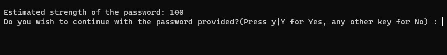
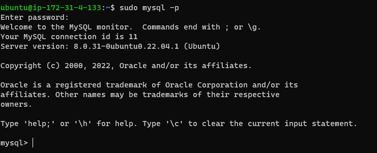
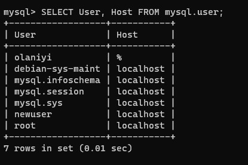
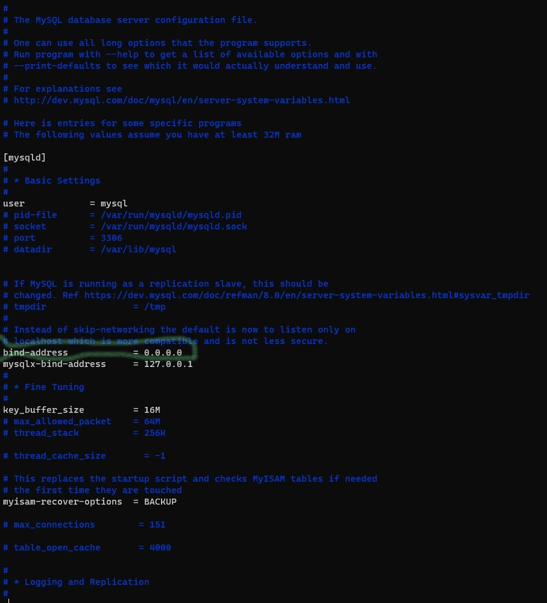
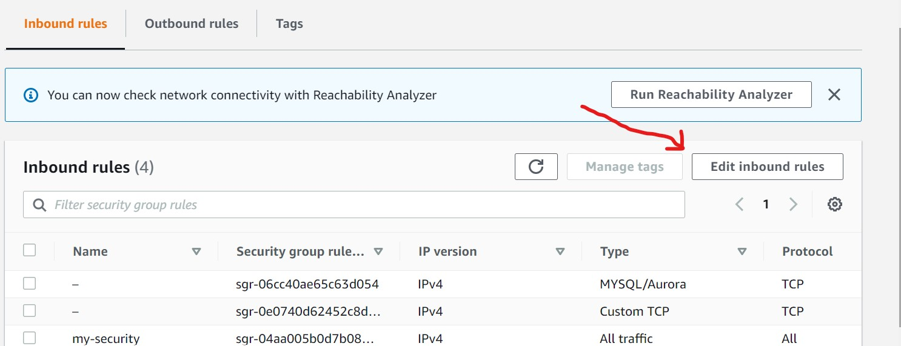
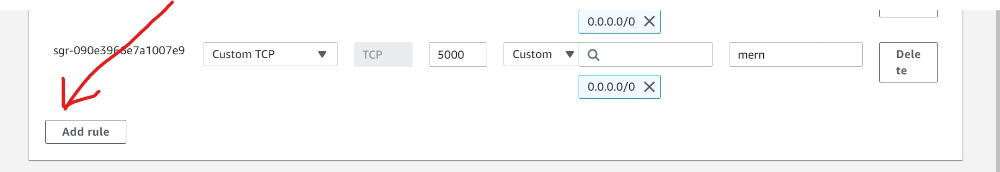
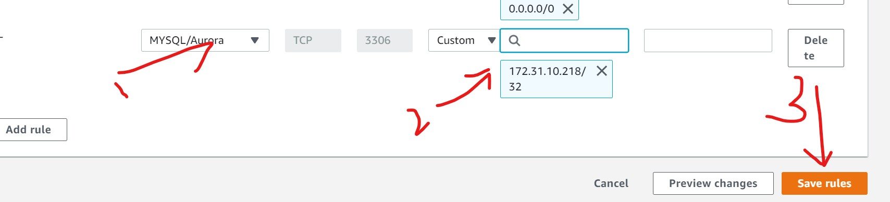
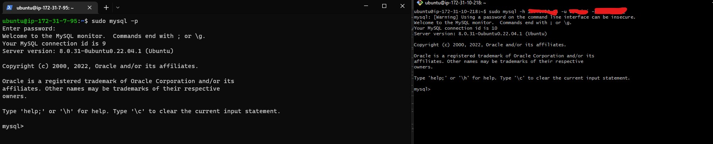

## CLIENT-SERVER ARCHITECTURE WITH MYSQL

## IMPLEMENT A CLIENT SERVER ARCHITECTURE USING MYSQL DATABASE MANAGEMENT SYSTEM (DBMS).

To start the project, two ubuntu servers need to be created on AWS instance

name the first one "server"
name the second one "client"

Then, install mysql server on the server by using the command:

`sudo apt install -y mysql-server` 

On mysql client server install "mysql client" with command:

`sudo apt install -y mysql-client`

open the mysql console for server and and run a security script with command:

`ALTER USER 'root'@'localhost' IDENTIFIED WITH mysql_native_password BY '<password of your choice>';`

Note: the password you create in above command is for the root user. 

Then exit the mysql console 

Start an interactive script with command:

`sudo mysql_secure_installation`

Then, create a strong password. Then strength of your password will be shown as displayed in the image below:

login back to mysql server console with command :

`sudo mysql -p`

This will request for the password you have created.

Note: If you have successfully logged in you will see a message like the one displayed in the image below:

Create a new user on your mysql server user table with command:

`CREATE USER 'newuser'@'%' IDENTIFIED WITH mysql_native_password BY 'password of your choice';`

To confirm that user has been created, open the mysql server user table with command:

`SELECT User, Host FROM mysql.user;`

This command will bring out the list of all existing users as shown in the image below:

create database with command:
 `CREATE DATABASE <database name>;`

Then, grant access to the new user you created with command:

`GRANT ALL PRIVILEGES ON <database>.* TO '<username>'@'%' WITH GRANT OPTION;`

and flush the privileges with command:

`FLUSH PRIVILEGES;`

once all these has been done, exit the mysql console. 

It is necessary to enable mysql server to allow request from the remote mysql client. 
To do this, run the command:

`sudo vi /etc/mysql/mysql.conf.d/mysqld.cnf`

Replace  the bind-address which by default is `127.0.0.1` with `0.0.0.0` as show in the image below:

Run the below command to restart the mysql server:

`sudo systemctl restart mysql`

After this has been done, there is a need to open port 3306 on the mysql server to allow connection from the mysql client. 

To do this, get the ip address of the mysql client by running command 

`ip addr show` or `ifconfig` on the mysql client 

Note: Should you don't have net-tools installed, you may not be able to use `ifconfig` command. Run `sudo apt install net-tools` to install net-tools

After generating the ip address, open the security group of your mysql server on the EC2 instance and open port 3306 following the steps below:

open your mysql server security group ad click on edit inbound rules

click on add rules

paste in the ip generated from mysql client

After adding port 3306, from the mysql client linux server, connect remotely to the mysql server database engine with the command below:

`sudo mysql -h <server public ip> -u <server username> -p<server password>`

If you have the same output from both your server and client linux server it means you have successfully login remotely without ssh and congratuations to you for the successful connection. 

